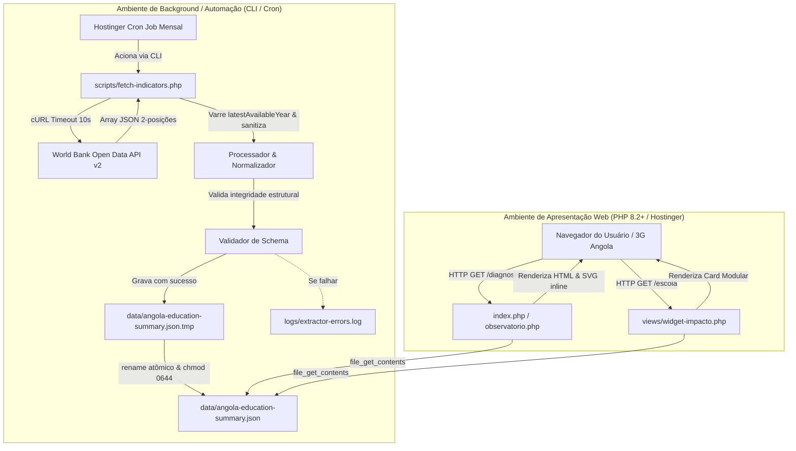
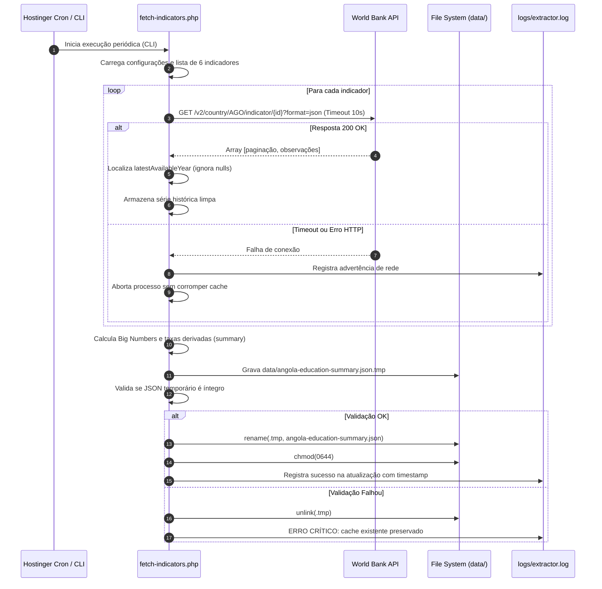

# Arquitetura do Extrator PHP e Especificação do Cache Estático JSON

> **Fase 2 do WDLC (Planning & Architecture)**  
> Projeto: Observatório de Diagnóstico Educacional de Angola & Luanda  
> Repositório: `nova-esperanca-angola/diagnostico-educacional-luanda`  
> Referência: [Issue #2](https://github.com/nova-esperanca-angola/diagnostico-educacional-luanda/issues/2)

---

## 1. Princípios Arquiteturais

A arquitetura do observatório foi concebida para atender às restrições de hospedagem compartilhada (Hostinger hPanel), conexões móveis lentas em Angola e garantir disponibilidade ininterrupta sem custos com bancos de dados relacionais (MySQL/PostgreSQL).

1. **Zero Runtime Latency (Desacoplamento Total)**:
   - A camada web pública (páginas PHP e widgets institucionais) **nunca** faz chamadas HTTP para APIs externas durante a requisição do usuário.
   - O tempo de resposta para leitura dos dados em disco é inferior a **5 milissegundos**, consumindo menos de 1 MB de memória RAM.
2. **Atomic File Replacement (Substituição Atômica)**:
   - Toda atualização de dados escreve primeiro em um arquivo temporário (`.tmp`).
   - A substituição ocorre via chamada atômica de sistema (`rename()`), eliminando o risco de leituras simultâneas de arquivos incompletos (*race conditions*).
3. **Fail-Safe Cache (Resiliência a Quedas de Rede)**:
   - Se a API do Banco Mundial estiver temporariamente indisponível ou retornar erro HTTP durante a execução do Cron, o script **não** sobrescreve nem apaga o cache existente. O cache prévio é mantido intacto e um log de alerta é gerado.
4. **Varredura Heurística `latestAvailableYear`**:
   - Para suprir as lacunas temporais históricas inerentes a relatórios de organismos multilaterais (como a taxa de matrícula pré-escolar, cujo dado mais recente consolidado data de 2016), o algoritmo varre a série histórica em ordem decrescente até encontrar o registro não-nulo mais recente.

---

## 2. Diagrama de Arquitetura de Componentes



---

## 3. Diagrama de Sequência da Rotina de Extração



---

## 4. Algoritmo de Gravação Atômica em PHP

A implementação da Fase 4 (`scripts/fetch-indicators.php`) deve adotar o seguinte padrão estrito:

```php
function saveAtomicCache(string $targetPath, array $payload): bool
{
    $tempPath = $targetPath . '.tmp.' . bin2hex(random_bytes(4));
    $jsonEncoded = json_encode($payload, JSON_PRETTY_PRINT | JSON_UNESCAPED_SLASHES | JSON_UNESCAPED_UNICODE);

    if ($jsonEncoded === false) {
        error_log("Erro de codificação JSON: " . json_last_error_msg());
        return false;
    }

    // 1. Grava no arquivo temporário
    if (file_put_contents($tempPath, $jsonEncoded, LOCK_EX) === false) {
        error_log("Falha ao gravar arquivo temporário: {$tempPath}");
        return false;
    }

    // 2. Valida se o arquivo gravado é legível e decodificável
    $verification = json_decode((string)file_get_contents($tempPath), true);
    if (!is_array($verification) || !isset($verification['summary'], $verification['indicators'])) {
        error_log("Verificação de integridade falhou no arquivo temporário.");
        @unlink($tempPath);
        return false;
    }

    // 3. Substituição atômica via rename do sistema operacional
    if (!rename($tempPath, $targetPath)) {
        error_log("Falha na substituição atômica de {$tempPath} para {$targetPath}");
        @unlink($tempPath);
        return false;
    }

    // 4. Ajusta permissão segura de leitura
    @chmod($targetPath, 0644);

    return true;
}
```

---

## 5. Especificação dos Blocos do JSON de Cache

O arquivo [`data/angola-education-summary.json`](file:///c:/Users/fboli/Projetos/nova-esperanca-angola/diagnostico-educacional-luanda/data/angola-education-summary.sample.json) é regido pelo schema [`schemas/angola-education-summary.schema.json`](file:///c:/Users/fboli/Projetos/nova-esperanca-angola/diagnostico-educacional-luanda/schemas/angola-education-summary.schema.json):

### 5.1. Bloco `metadata`
Contém as diretrizes de governança e rastreabilidade:
- `schema_version`: Versão semântica (ex.: `1.0.0`).
- `generated_at`: Timestamp ISO-8601 da geração.
- `country_iso3`: `"AGO"` (Angola).
- `data_sources`: Lista com nome, URL e classificação das fontes oficiais.

### 5.2. Bloco `summary`
Compilado de valores escalares imediatos para renderização sem cálculo adicional na UI:
- `child_population_pct`: **44,1%** (2025)
- `preprimary_gross_enrollment_pct`: **39,61%** (2016)
- `preprimary_deficit_pct`: **60,39%** (calculado: `100 - 39.61`)
- `primary_gross_enrollment_pct`: **86,74%** (2023)
- `out_of_school_primary_count`: **2.281.912** (2023)
- `education_gdp_pct`: **2,51%** (2023)
- `unesco_gdp_benchmark_min_pct`: **4,0%**
- `unesco_gdp_benchmark_max_pct`: **6,0%**
- `adult_literacy_pct`: **68,18%** (2023)

### 5.3. Bloco `indicators`
Dicionário indexado pelos 6 códigos do Banco Mundial, contendo fichas técnicas e o vetor `historical_series` com `{ year: int, value: float|null }`.

### 5.4. Bloco `regional_context`
Dados demográficos da Província de Luanda (população, notas metodológicas e desafios locais documentados pelo INE e UNICEF).

---

## 6. Próximos Passos (Transição para WDLC 3 e WDLC 4)

Com a arquitetura aprovada e o contrato JSON Schema formalizado:
- **WDLC 3 (Issue #3)**: Design de infográficos e componentes visuais em SVG puro / CSS leve baseados exclusivamente nas variáveis do bloco `summary`.
- **WDLC 4 (Issue #4)**: Implementação do script `scripts/fetch-indicators.php` seguindo os contratos e o padrão `saveAtomicCache()`.
